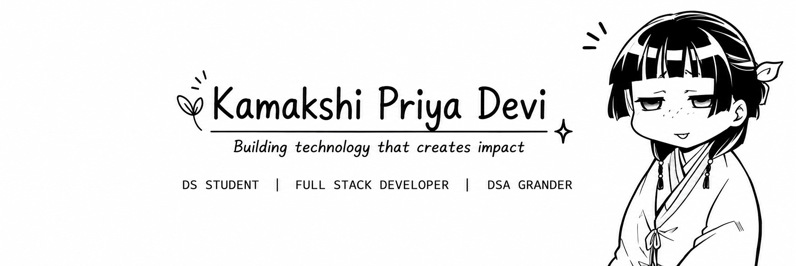

<!-- ===================== BANNER ===================== -->

  

<!-- ===================== ABOUT ME ===================== -->

<h2>🌿 About Me</h2>

  I am a <strong>Computer Science and Data Science undergraduate</strong>
  passionate about building scalable software and applying AI to solve
  real-world problems.

  I have hands-on experience in <strong>full-stack MERN development,
  AI-powered web applications, and data-driven problem solving</strong>.

  I enjoy working across the stack — from building responsive interfaces
  and REST APIs to integrating databases and AI-powered features.

<!-- ===================== TECHNICAL SKILLS ===================== -->

<h2>⚡ Technical Skills</h2>

### 💻 Programming Languages

  
  
  
  
  

### 🌐 Frontend

  
  
  
  

### ⚙️ Backend & Databases

  
  
  
  

### 🧰 Tools & Libraries

  
  
  
  
  
  
  
  

### 🧠 Core Concepts

`DSA` · `OOP` · `DBMS` · `Operating Systems` ·
`Computer Networks` · `REST APIs`

---

<!-- ===================== PROJECTS ===================== -->

<h2>🚀 Featured Projects</h2>

### 🏢 MSME Digital Operations Platform

**React.js · Node.js · Express.js · MySQL · JWT · Render**

A full-stack digital operations platform designed for MSMEs to manage
inventory, orders, vendors, employees, production, and reports through
a centralized dashboard.

**Highlights**

- Developed a centralized digital operations platform for MSMEs.
- Implemented JWT-based authentication and role-based access control.
- Built RESTful APIs and MySQL integration for secure user management
  and CRUD operations.
- Deployed the application on Render.
- Configured CORS, environment variables, and frontend-backend integration.

**[View Project](YOUR_MSME_PROJECT_LINK)**

---

### 🧭 Digital Career Twin

**React.js · FastAPI · PostgreSQL · Anthropic Claude API · JWT · Vercel**

An AI-powered career guidance platform that generates personalized career
roadmaps based on users' skills, interests, academic background, and
career goals.

**Highlights**

- Integrated the Anthropic Claude API for personalized career guidance.
- Added customized interview preparation and career recommendations.
- Implemented skill-gap analysis.
- Built secure JWT authentication and user profile management.
- Added intelligent learning-resource recommendations.
- Integrated the YouTube Data API.
- Built using FastAPI and PostgreSQL.

**[View Project](YOUR_CAREER_TWIN_PROJECT_LINK)**

---

### 🎵 Mood-Based Music Player using Face Detection

**Python · Django · OpenCV · Hugging Face · Spotify API · Render**

A real-time emotion detection application that identifies users' emotions
and recommends music based on their detected mood.

**Highlights**

- Developed real-time emotion detection using OpenCV and facial analysis.
- Integrated Hugging Face models for emotion-related processing.
- Connected the Spotify API for personalized music recommendations.
- Built a responsive Django web application.
- Deployed the application on Render.

**[View Project](YOUR_MUSIC_PLAYER_PROJECT_LINK)**

---

<h2>🌐 Connect With Me</h2>

---

  <i>Building technology that creates impact.</i>

